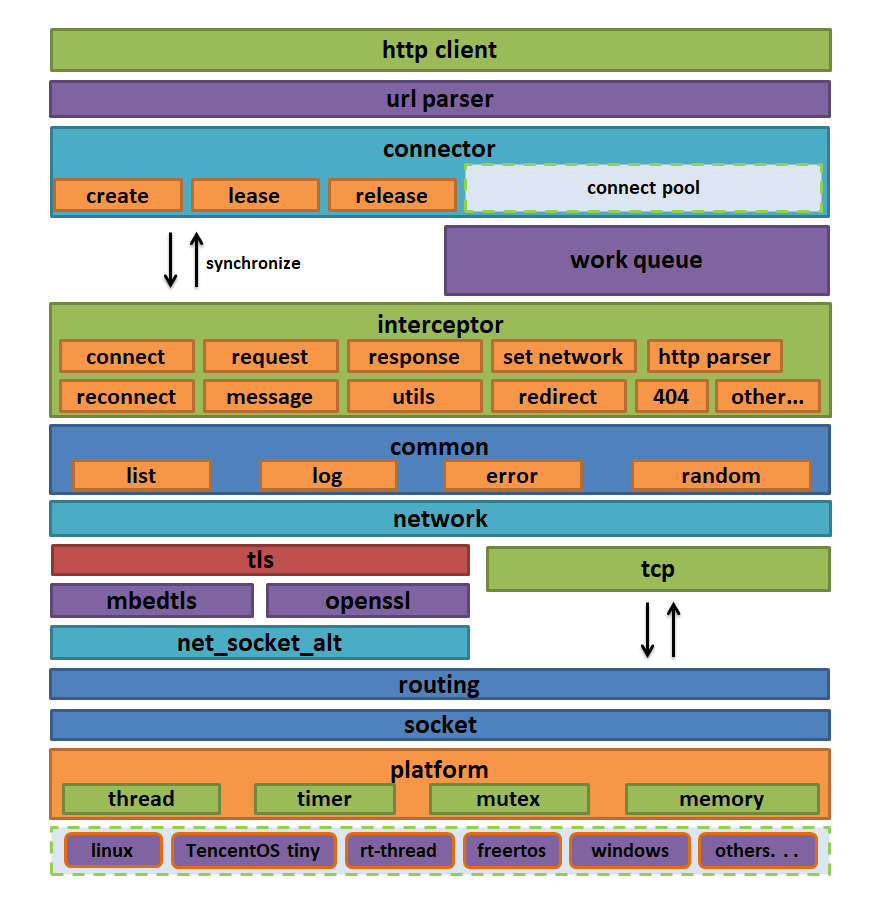

# 开发计划

本文档是开发的计划，随时更新，欢迎以 [GitHub Issues](https://github.com/jiejieTop/http-client/issues) 的形式提交功能需求、问题和 bug 报告等。

框架如下：

## 平台抽象层

| 完成度 | 功能需求 |
| -- | -- |
| ☑ | 内存管理 |
| ☑ | 线程管理 |
| ☑ | 时间管理 |
| ☑ | 互斥锁 |
| ☑ | socket API 或者 AT|

## network 网卡

| 完成度 | 功能需求 |
| -- | -- |
| ☑ | 网卡初始化 |
| ☑ | 连接服务器 |
| ☑ | 终止连接 |
| ☑ | 读操作 |
| ☑ | 写操作 |
| ☑ | tcp 直连通道 |
| ☑ | tls 加密传输通道 |
| ☑ | 哈希算法的实现 |
| ☑ | 记录 host 与 IP 地址的对应关系 |
| ☑ | 根据 url 的 host 参数查找对应的 ip（算是本地的 dns 缓存） |
| - | 使用 openssl |

## 通用组件开发

| 完成度 | 功能需求 |
| -- | -- |
| ☑ | 列表操作 |
| ☑ | 日志显示 |
| ☑ | 错误代码 |
| ☑ | 随机数生成器 |

## 基础组件开发

| 完成度 | 功能需求 |
| -- | -- |
| ☑ | 字符串与整形互转 |
| ☑ | 动态计算字符串的大小，可变参数 |
| ☑ | 处理字符串时的内存动态分配，realloc 方式 |
| ☑ | 字符串连接，可变参数 |
| ☑ | 字符串匹配处理（忽略大小写、指定匹配 n 个字符串等） |
| - | - |

## url解析器

| 完成度 | 功能需求 |
| -- | -- |
| ☑ | 通过 url 解析各个字段的内容 |
| - | - |

## HTTP 报文处理

| 完成度 | 功能需求 |
| -- | -- |
| ☑ | 报文初始化、释放、内存空间增长等基础功能 |
| ☑ | 报文字段动态管理内存空间 |
| ☑ | 报文字段的连接、追加 |
| ☑ | 支持覆盖、引用的方式写入报文 |
| - | - |

## HTTP 请求

| 完成度 | 功能需求 |
| -- | -- |
| ☑ | http 请求初始化 |
| ☑ | 根据 path 构建请求起始行 |
| ☑ | 根据 key-value 构建请求头部 |
| ☑ | 根据索引添加请求头部字段，若存在则不添加 |
| ☑ | 根据需求构建请求主体，填充请求头部字段的主体长度 |
| ☑ | 填充必要的 http 请求报文信息 |
| ☑ | 支持设置 HTTP 协议版本 / 请求方法等 |
| ☑ | 设置长连接 / 非长连接 |
| ☑ | 打印 / 获取 HTTP 请求报文各个字段内容 |
| ☑ | 发送 http 请求报文 |
| - | - |

## HTTP 响应

| 完成度 | 功能需求 |
| -- | -- |
| ☑ | 响应结构初始化 |
| ☑ | 响应结构释放 |
| ☑ | 设置、获取响应结构中的私有信息，比如响应报文长度、偏移、响应报文状态等 |
| - | - |

## 拦截器

| 完成度 | 功能需求 |
| -- | -- |
| ☑ | 拦截器初始化网卡 |
| ☑ | 根据解析的 url 信息连接服务器 |
| ☑ | 发起 http 连接服务器 |
| ☑ | 构建完整的 http 请求报文 |
| ☑ | 完成正常的 http 请求操作 |
| ☑ | 初始化 http_parser、parser_settings，为解析响应报文做准备 |
| ☑ | 拦截器状态机处理 |
| ☑ | 解析 HTTP 响应报文 |
| ☑ | 处理重连请求 |
| ☑ | 处理重定向信息 |
| ☑ | 数据正常递交给上层 |
| - | 处理身份验证 |
| - | - |

## 工作队列

| 完成度 | 功能需求 |
| -- | -- |
| ☑ | 工作队列池的初始化与销毁 |
| ☑ | 创建/销毁工作队列 |
| ☑ | 创建/销毁/等待工作线程 |
| ☑ | 添加任务到工作队列中 |
| ☑ | 根据先后顺序将数据递交给拦截器 |
| - | - |

## client

| 完成度 | 功能需求 |
| -- | -- |
| ☑ | 连接的相关参数初始化 |
| ☑ | 连接参数的获取、设置 |
| ☑ | 实现内部事件处理函数，根据用户感兴趣的事件回调处理 |
| ☑ | 工作队列处理函数，将处理添加到工作队列中 |
| ☑ | 初始化/销毁 client 池 |
| ☑ | 租借、释放 client 结构 |
| ☑ | GET 处理 |
| ☑ | POST 处理 |
| - | - |

## url 解析器

| 完成度 | 功能需求 |
| -- | -- |
| ☑ | 解析 url 各个字段的参数 |
| - | - |

## 如何参与开发

[如何参与开发，提交 PR？](./how_to_pr.md)

**下一篇**：[平台抽象层—内存管理](./platform_memory.md)
